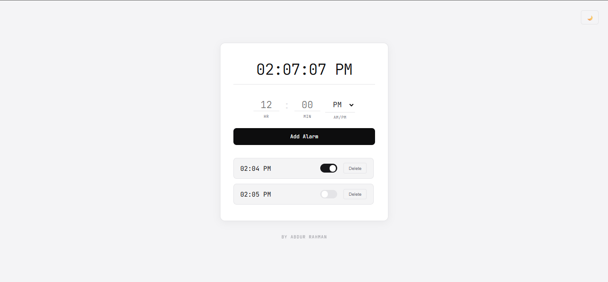
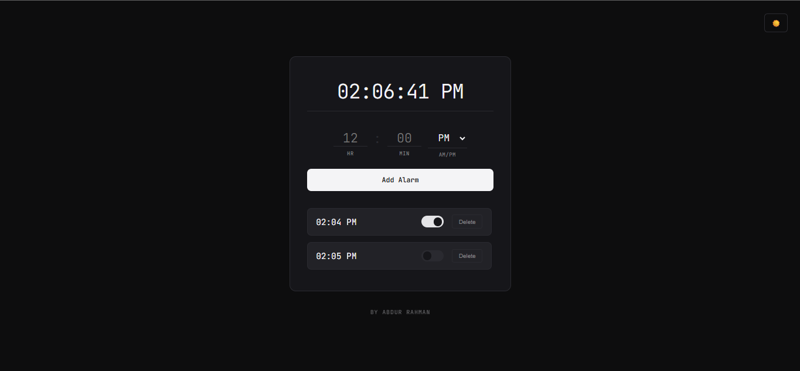

# ⏰ Alarm Clock App

A simple yet functional alarm clock web application built using HTML, CSS, and JavaScript. It allows users to set multiple alarms, manage them efficiently, and switch between light and dark themes.

---

## ✨ Features

- ⏰ Live digital clock display
- 🔔 Set multiple alarms
- 🔄 Toggle alarm ON/OFF
- 🗑️ Delete alarms
- 📊 Auto-sorting alarms by time
- 🌙 Light & Dark mode toggle
- 🎨 Clean and responsive UI

---

## 🛠️ Tech Stack

- HTML5
- CSS3
- JavaScript

---

## 📸 Preview





---

## 🚀 Getting Started

 Clone the repository

```bash
git clone https://github.com/your-username/alarm-clock.git
Navigate to project folder
cd alarm-clock
Run the project
```
Open index.html in your browser.

---

## 📂 Project Structure

```bash
alarm-clock/
│── index.html
│── style.css
│── script.js
└── screenshot.png
```
---

## 👨‍💻 Author
Made with ❤️ by Abdur Rahman
